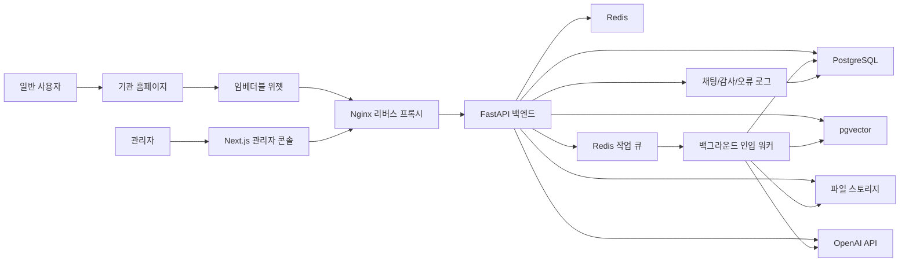
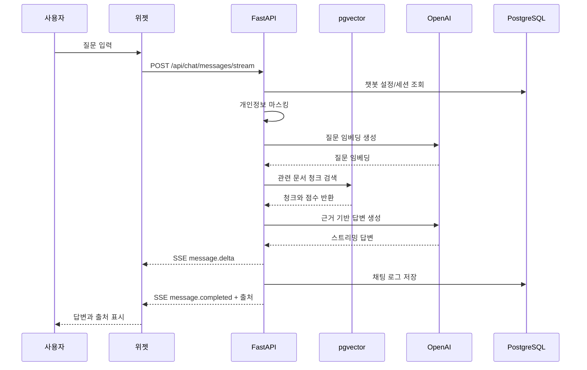

# 07. 시스템 아키텍처

이 문서는 이음봇(IEUMBOT)의 MVP 시스템 아키텍처를 정의합니다. 대상 스택은 관리자 프런트엔드 Next.js, 임베더블 위젯, FastAPI 백엔드, PostgreSQL, pgvector, Redis, 파일 스토리지, OpenAI 연동, Nginx 리버스 프록시, 백그라운드 문서 처리 워커입니다.

## 1. 전체 구성 개요

이음봇은 공개 웹사이트에 삽입되는 위젯과 관리자 콘솔을 하나의 API 백엔드가 지원하는 구조로 시작합니다.

- 사용자 위젯은 외부 홈페이지에 삽입되어 채팅 설정을 불러오고 질문을 전송합니다.
- 관리자 콘솔은 Next.js 기반 웹 애플리케이션으로 문서, 설정, 로그, 테스트 채팅을 관리합니다.
- API 백엔드는 FastAPI로 구현하며 위젯 API, 관리자 API, RAG API, 파일 업로드 API를 제공합니다.
- PostgreSQL은 주요 관계형 데이터를 저장합니다.
- pgvector는 문서 청크 임베딩 검색을 담당합니다.
- Redis는 세션, 캐시, 큐 브로커, 속도 제한에 사용합니다.
- 파일 스토리지는 업로드된 PDF 원본과 처리 산출물을 저장합니다.
- 백그라운드 워커는 PDF 텍스트 추출, 청킹, 임베딩 생성, 색인 저장을 수행합니다.
- OpenAI API는 임베딩 생성과 답변 생성을 담당합니다.
- Nginx는 TLS 종료, 정적 파일 서빙, API 라우팅, 리버스 프록시 역할을 수행합니다.

## 2. 주요 컴포넌트 설명

### 관리자 프런트엔드: Next.js

역할:

- 관리자 로그인, 대시보드, 문서 관리, 웹 소스 관리, 챗봇 설정, 개인정보 설정, 빠른 액션, 테스트 채팅, 로그, 분석 화면을 제공합니다.
- 서버 API와 통신해 운영 데이터를 조회하고 변경합니다.

구현 기준:

- 관리자 라우트는 `/admin/*` 기준으로 구성합니다.
- 인증 상태는 HTTP-only 세션 쿠키 또는 보안 토큰 기반으로 처리합니다.
- 목록 화면은 서버 페이지네이션을 기본으로 합니다.
- 테스트 채팅은 SSE 응답을 받을 수 있어야 합니다.

### 임베더블 위젯

역할:

- 외부 홈페이지에 삽입되는 공개 채팅 UI입니다.
- 런처 버튼, 채팅 패널, 빠른 액션, 메시지, 출처, 입력 영역을 제공합니다.

구현 기준:

- 삽입 스크립트 예: `<script src="https://cdn.ieumbot.example/widget.js" data-chatbot-id="..."></script>`
- 위젯은 호스트 페이지 CSS와 충돌하지 않도록 Shadow DOM 또는 강한 네임스페이스를 사용합니다.
- 설정 로드, 메시지 전송, SSE 수신, 출처 렌더링을 담당합니다.
- 위젯 설정 API 호출 시 현재 도메인이 허용 도메인인지 검증됩니다.

### API 백엔드: FastAPI

역할:

- 관리자 API, 위젯 API, 채팅 API, 파일 업로드 API, 로그 API를 제공합니다.
- 인증, 권한, 테넌트 검증, 개인정보 마스킹, RAG 오케스트레이션을 담당합니다.

구현 기준:

- `/api/admin/*`: 관리자 콘솔 API
- `/api/widget/*`: 공개 위젯 설정 API
- `/api/chat/*`: 사용자 채팅 API
- `/api/files/*`: 파일 접근 또는 업로드 API
- 모든 요청에는 가능한 경우 `requestId`를 부여합니다.
- 위젯 공개 API도 챗봇 ID, 도메인, 속도 제한을 검증합니다.

### PostgreSQL

역할:

- 조직, 챗봇, 관리자, 설정, 문서 메타데이터, 문서 버전, 채팅 로그, 감사 로그를 저장합니다.

주요 데이터:

- `organizations`
- `chatbots`
- `admins`
- `roles`
- `documents`
- `document_versions`
- `document_chunks`
- `chat_sessions`
- `chat_messages`
- `quick_actions`
- `audit_logs`
- `web_sources`

### pgvector

역할:

- 문서 청크 임베딩을 저장하고 유사도 검색을 수행합니다.

구현 기준:

- `document_chunks` 또는 별도 `chunk_embeddings` 테이블에 벡터 컬럼을 둡니다.
- 검색 시 `organization_id`, `chatbot_id`, `document_version_id`, `is_active` 조건을 함께 적용합니다.
- MVP에서는 PostgreSQL + pgvector로 시작하고, 검색 규모가 커지면 별도 벡터 DB 전환을 검토합니다.

### Redis

역할:

- 백그라운드 작업 큐
- 짧은 TTL 캐시
- 속도 제한 카운터
- SSE 연결 상태 보조
- 일시적 세션 상태

구현 기준:

- 문서 처리 작업은 Redis 큐에 등록합니다.
- 위젯 설정은 짧은 TTL로 캐싱할 수 있습니다.
- 채팅 API는 챗봇 ID와 IP 또는 세션 기준 속도 제한을 적용합니다.

### 파일 스토리지

역할:

- PDF 원본 파일과 처리 산출물을 저장합니다.

구현 기준:

- MVP는 로컬 볼륨 또는 S3 호환 스토리지를 사용할 수 있습니다.
- 운영 환경은 S3 호환 오브젝트 스토리지를 권장합니다.
- 파일 경로는 내부 식별자 기반으로 저장하고 원본 파일명만 메타데이터로 보관합니다.
- 파일 접근은 인증과 권한 검사를 거쳐야 합니다.

### OpenAI 연동

역할:

- 문서 청크 임베딩 생성
- 사용자 질문 임베딩 생성
- RAG 답변 생성
- 필요 시 질의 재작성 또는 답변 검증

구현 기준:

- API 키는 환경 변수 또는 비밀 관리 도구로 주입합니다.
- 모델 호출 전 개인정보 마스킹을 적용합니다.
- 모델 호출 실패, 지연, 토큰 사용량을 로그로 남깁니다.
- 답변 생성은 검색된 근거 조각과 정책 프롬프트를 함께 사용합니다.

### Nginx 리버스 프록시

역할:

- TLS 종료
- 관리자 프런트엔드 라우팅
- API 백엔드 프록시
- 위젯 정적 파일 배포
- 업로드 크기 제한
- 기본 보안 헤더 설정

라우팅 예:

- `/admin` -> Next.js
- `/api` -> FastAPI
- `/widget.js` 또는 `/widget/*` -> 위젯 정적 번들
- `/health` -> 상태 확인 엔드포인트

### 백그라운드 인입 워커

역할:

- 문서 업로드 후 비동기 처리 작업을 수행합니다.

처리 단계:

1. PDF 원본 로드
2. 파일 검증
3. 텍스트 추출
4. 페이지와 섹션 단위 정규화
5. 청킹
6. OpenAI 임베딩 생성
7. pgvector 색인 저장
8. 문서 상태 갱신
9. 실패 시 오류 로그와 재시도 가능 상태 저장

## 3. 사용자 요청 처리 흐름

일반 사용자가 외부 홈페이지에서 위젯을 사용하는 흐름입니다.

1. 사용자가 기관 홈페이지에 접속합니다.
2. 홈페이지가 위젯 스크립트를 로드합니다.
3. 위젯은 `data-chatbot-id`와 현재 도메인으로 `/api/widget/config`를 호출합니다.
4. FastAPI는 챗봇 ID, 활성 상태, 허용 도메인을 검증합니다.
5. 설정이 유효하면 위젯 테마, 인사말, 빠른 액션, 개인정보 안내를 반환합니다.
6. 사용자가 질문을 입력합니다.
7. 위젯은 `/api/chat/messages` 또는 SSE 엔드포인트로 질문을 전송합니다.
8. FastAPI는 세션 ID를 확인하거나 생성합니다.
9. 개인정보 마스킹, 속도 제한, 테넌트 검증을 수행합니다.
10. RAG 파이프라인을 실행합니다.
11. 답변, 출처, 상태를 위젯으로 반환합니다.
12. 채팅 로그와 처리 시간이 저장됩니다.

## 4. 관리자 요청 처리 흐름

관리자가 콘솔에서 설정 또는 데이터를 조회하는 흐름입니다.

1. 관리자가 `/admin/login`에 접속합니다.
2. Next.js가 로그인 화면을 표시합니다.
3. 로그인 요청은 `/api/admin/auth/login`으로 전달됩니다.
4. FastAPI는 계정, 비밀번호, 계정 상태를 검증합니다.
5. 인증 성공 시 세션 쿠키 또는 토큰을 발급합니다.
6. 관리자가 문서 관리, 설정, 로그 화면에 접근합니다.
7. Next.js는 `/api/admin/*` API를 호출합니다.
8. FastAPI는 인증, 역할 권한, 조직과 챗봇 범위를 검증합니다.
9. PostgreSQL에서 데이터를 조회하거나 변경합니다.
10. 변경 작업은 감사 로그에 저장됩니다.
11. 관리자 화면은 결과와 상태를 표시합니다.

## 5. 문서 업로드/처리 흐름

PDF 문서 업로드와 색인 처리 흐름입니다.

1. 관리자가 문서 관리 화면에서 PDF를 선택합니다.
2. Next.js는 파일과 메타데이터를 `/api/admin/chatbots/{chatbotId}/documents`로 전송합니다.
3. FastAPI는 관리자 권한, 파일 크기, MIME 타입, 확장자를 검증합니다.
4. 원본 PDF를 파일 스토리지에 저장합니다.
5. PostgreSQL에 문서와 문서 버전 레코드를 생성합니다.
6. 문서 상태를 `uploaded` 또는 `processing`으로 저장합니다.
7. Redis 큐에 인입 작업을 등록합니다.
8. 백그라운드 워커가 작업을 가져옵니다.
9. 워커는 텍스트 추출, 청킹, 임베딩 생성, pgvector 저장을 수행합니다.
10. 성공 시 문서 버전을 `ready` 상태로 변경하고, 문서의 `current_version_id`를 새 버전으로 갱신합니다.
11. 실패 시 실패 단계, 오류 코드, 재시도 가능 여부를 저장합니다.
12. 관리자 콘솔은 폴링 또는 향후 이벤트 기반 갱신으로 처리 상태를 표시합니다.

## 6. RAG 질의응답 흐름

RAG 기반 답변 생성은 다음 단계로 구성합니다.

1. 사용자 질문 수신
2. 요청 ID 생성
3. 챗봇 설정 조회
4. 개인정보 마스킹
5. 질문 길이와 속도 제한 검증
6. 필요 시 대화 맥락 기반 질의 재작성
7. OpenAI 임베딩 API로 질문 임베딩 생성
8. pgvector에서 관련 문서 청크 검색
9. `chatbot_id`, `organization_id`, 활성 문서 버전 기준 필터링
10. 검색 점수와 최소 기준을 평가
11. 근거 부족 시 제한 응답 반환
12. 근거 충분 시 시스템 프롬프트, 페르소나, 톤, 검색 청크를 조합
13. OpenAI 답변 생성 모델 호출
14. 답변 후처리와 출처 매핑
15. 채팅 로그 저장
16. 위젯 또는 테스트 콘솔로 답변 반환

검색 결과에는 최소한 다음 메타데이터가 필요합니다.

- 문서 ID
- 문서 버전 ID
- 문서명
- 페이지 번호
- 청크 ID
- 청크 텍스트
- 유사도 점수
- 원문 파일 또는 웹 URL

## 7. 실시간 응답(SSE) 흐름

MVP에서는 WebSocket보다 단순한 Server-Sent Events를 우선 검토합니다. 사용자는 답변 생성 진행 상태와 스트리밍 답변을 받을 수 있습니다.

1. 위젯 또는 테스트 콘솔이 `POST /api/chat/messages/stream`을 호출합니다.
2. FastAPI는 `Content-Type: text/event-stream`으로 응답을 시작합니다.
3. 서버는 `requestId` 이벤트를 먼저 전송합니다.
4. 개인정보 마스킹과 검색 단계가 진행되면 상태 이벤트를 전송할 수 있습니다.
5. OpenAI 스트리밍 응답을 수신합니다.
6. 서버는 토큰 또는 문장 단위로 `message.delta` 이벤트를 전송합니다.
7. 답변 생성이 끝나면 `message.completed` 이벤트에 출처 목록을 포함합니다.
8. 오류 발생 시 `message.error` 이벤트를 전송하고 연결을 종료합니다.
9. 최종 답변과 출처, 처리 시간은 로그에 저장합니다.

SSE 이벤트 예:

```text
event: request.created
data: {"requestId":"req_123"}

event: message.delta
data: {"text":"신청 기간은 "}

event: message.completed
data: {"citations":[{"documentTitle":"공고문.pdf","pageNumber":3}]}
```

운영 기준:

- Nginx에서 SSE 응답 버퍼링을 비활성화해야 합니다.
- 연결 타임아웃을 일반 API보다 길게 설정합니다.
- 클라이언트는 연결 실패 시 일반 비스트리밍 API 또는 재시도를 사용할 수 있어야 합니다.

## 8. 외부 홈페이지 삽입 구조

외부 홈페이지는 위젯 스크립트만 삽입하고, 위젯 내부 UI와 API 통신은 이음봇 서버가 담당합니다.

삽입 예:

```html
<script
  src="https://ieumbot.example/widget.js"
  data-chatbot-id="chatbot_123"
  async
></script>
```

동작 방식:

1. 스크립트가 로드됩니다.
2. 스크립트는 `data-chatbot-id`를 읽습니다.
3. 현재 `window.location.hostname`을 포함해 설정 API를 호출합니다.
4. 서버는 허용 도메인과 챗봇 활성 상태를 검증합니다.
5. 위젯은 Shadow DOM 또는 격리 컨테이너를 생성합니다.
6. 런처 버튼과 채팅 패널을 렌더링합니다.
7. 사용자의 질문은 이음봇 API로 전송됩니다.

주의사항:

- 위젯은 호스트 페이지의 인증 상태에 의존하지 않습니다.
- 위젯은 호스트 페이지의 전역 CSS를 변경하지 않습니다.
- 위젯은 호스트 페이지의 폼 제출, 라우팅, 스크롤 동작을 방해하지 않아야 합니다.
- 허용 도메인이 아닌 곳에서 삽입되면 설정 API가 거부하고 위젯은 렌더링하지 않습니다.

## 9. 멀티테넌시 고려사항

MVP는 단일 조직 또는 제한된 조직 수를 기준으로 시작하되, 데이터 모델과 API는 멀티테넌시 확장을 고려합니다.

### 테넌트 경계

- 모든 주요 데이터는 `organization_id`를 포함해야 합니다.
- 챗봇 단위 설정은 `chatbot_id`로 구분합니다.
- 문서, 청크, 로그, 빠른 액션, 웹 소스는 조직과 챗봇 범위를 함께 가져야 합니다.

### API 검증

- 관리자 API는 세션의 조직 권한과 요청 대상 조직을 비교합니다.
- 위젯 API는 챗봇 ID와 허용 도메인을 함께 검증합니다.
- RAG 검색은 현재 챗봇에 연결된 활성 문서만 대상으로 합니다.

### 색인 분리

- MVP에서는 단일 pgvector 테이블에 조직과 챗봇 필터를 적용할 수 있습니다.
- 데이터가 증가하면 조직별 파티셔닝, 별도 스키마, 별도 색인 저장소를 검토합니다.

### 로그 분리

- 로그 조회는 관리자 권한 범위 내 조직과 챗봇으로 제한합니다.
- 운영 분석은 조직별 집계가 가능해야 합니다.
- 개인정보 정책과 로그 보관 기간은 조직별 설정으로 확장 가능해야 합니다.

## 10. 장애 지점 및 대응 포인트

### Nginx 장애

- 영향: 관리자 콘솔, 위젯, API 접근 전체 장애
- 대응:
  - 헬스 체크 구성
  - 설정 변경 전 검증
  - 이전 Nginx 설정으로 즉시 롤백 가능해야 함

### Next.js 관리자 프런트엔드 장애

- 영향: 관리자 콘솔 사용 불가
- 대응:
  - 공개 위젯 API와 채팅 API는 별도 동작 유지
  - 정적 빌드 또는 이전 버전 재배포

### 위젯 번들 장애

- 영향: 외부 홈페이지에서 위젯 로드 실패
- 대응:
  - 버전 파일명 또는 해시 기반 배포
  - 이전 안정 위젯 번들 보관
  - 배포 후 샘플 페이지에서 즉시 검증

### FastAPI 장애

- 영향: 채팅, 관리자 API, 설정 API 장애
- 대응:
  - 프로세스 매니저 또는 컨테이너 재시작
  - 헬스 체크와 오류율 모니터링
  - 이전 안정 버전 롤백

### PostgreSQL 장애

- 영향: 설정, 문서, 로그, 인증 데이터 접근 장애
- 대응:
  - 정기 백업
  - 복구 절차 문서화
  - 중요 변경 전 백업

### pgvector 검색 장애

- 영향: RAG 검색 불가, 답변 품질 저하
- 대응:
  - 제한 응답으로 폴백
  - 문서 청크와 임베딩 메타데이터로 색인 재생성
  - 검색 실패율 모니터링

### Redis 장애

- 영향: 문서 처리 큐, 캐시, 속도 제한 장애
- 대응:
  - API 핵심 기능은 가능한 DB 직접 조회로 폴백
  - 문서 처리 작업은 Redis 복구 후 재시도
  - 큐 유실 가능성에 대비해 DB에 작업 상태를 함께 저장

### 파일 스토리지 장애

- 영향: PDF 업로드, 원문 접근, 문서 재처리 장애
- 대응:
  - 업로드 실패를 명확히 표시
  - 원본 파일 백업 정책 유지
  - 기존 색인이 있으면 채팅은 계속 가능하도록 구성

### OpenAI API 장애

- 영향: 임베딩 생성, 답변 생성 실패
- 대응:
  - 사용자에게 일시적 오류 또는 제한 응답 표시
  - 모델 호출 오류율 모니터링
  - 재시도 정책과 타임아웃 설정
  - 문서 업로드 중 임베딩 실패 작업은 재시도 가능 상태로 저장

### 백그라운드 워커 장애

- 영향: 새 문서 처리 지연 또는 실패
- 대응:
  - 기존 활성 문서 색인은 유지
  - 실패 작업 재시도
  - 워커 헬스 체크와 큐 적체량 모니터링

## Mermaid 다이어그램




